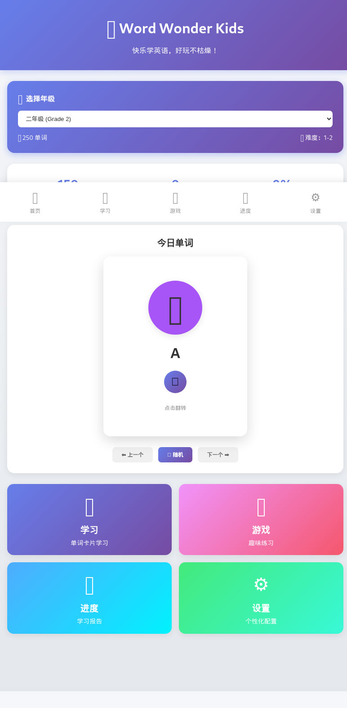

# Word Wonder Kids H5 🦞

> 儿童英语单词学习应用 - Angular H5 版本

[](https://github.com/nomospace/word-wonder-kids/actions)
[](https://opensource.org/licenses/MIT)

## 📱 项目介绍

专为儿童设计的英语单词学习 Web 应用，支持 Web 和移动端设备。通过游戏化方式帮助孩子记住核心英语单词，支持认读、跟读、拼写练习。

### ✨ 核心功能

- 🎓 **年级选择** - 支持学前班到六年级，可配置选择
- 🎴 **单词卡片** - 图文 + 发音 + 例句，点击即学
- 🎮 **游戏化练习** - 连连看、听音选词、拼写挑战、单词测验
- 📊 **进度追踪** - 学习报告和掌握程度统计
- 🔊 **TTS 发音** - 浏览器原生语音合成
- 📴 **离线使用** - PWA 支持，可离线学习

### 🏗️ 技术栈

- **框架**: Angular 17+
- **语言**: TypeScript
- **状态管理**: RxJS
- **样式**: SCSS
- **发音**: Web Speech API (TTS)
- **部署**: GitHub Pages

### 📚 单词库来源

- **Oxford 3000** - 牛津核心 3000 词
- **Dolch Sight Words** - 最常见的 220 个英语单词
- **Fry Words** - 弗里 1000 词

覆盖分类：
- 颜色 (Colors)
- 动物 (Animals)
- 文具 (School)
- 数字 (Numbers)
- 日常用品 (Daily)
- 食物 (Food)
- 家庭 (Family)
- 自然 (Nature)
- 动作 (Actions)
- 情感 (Emotions)

## 🚀 快速开始

### 环境要求

- Node.js >= 18.0.0
- npm >= 9.0.0

### 安装依赖

```bash
cd app
npm install
```

### 开发模式

```bash
npm start
```

访问 http://localhost:4200

### 构建生产版本

```bash
npm run build
```

输出目录：`dist/word-wonder-h5/browser/`

### 部署到 GitHub Pages

```bash
npm install -g angular-cli-ghpages
ng deploy --base-href=/word-wonder-kids/
```

## 📱 应用预览

### 主界面


应用采用响应式设计，支持 Web 和移动端设备。

## 🎮 游戏模式

1. **连连看** - 匹配单词和中文意思
2. **听音选词** - 听发音选择正确的单词
3. **拼写挑战** - 补全字母拼写单词
4. **单词测验** - 选择题测试

## 📊 学习进度

- 总体掌握率统计
- 按分类掌握情况
- 需要复习的单词
- 已掌握的单词列表

## ⚙️ 设置

- TTS 语速和音调调节
- 每日学习目标
- 学习提醒
- 字体大小
- 深色模式

## 📦 项目结构

```
app/
├── src/
│   ├── app/
│   │   ├── components/        # 可复用组件
│   │   │   ├── grade-selector/  # 年级选择器
│   │   │   └── word-card/       # 单词卡片
│   │   ├── data/              # 数据文件
│   │   │   └── word-data.ts   # 单词库
│   │   ├── models/            # 数据模型
│   │   │   └── word.model.ts
│   │   ├── pages/             # 页面组件
│   │   │   ├── home/          # 首页
│   │   │   ├── learn/         # 学习页
│   │   │   ├── game/          # 游戏页
│   │   │   ├── progress/      # 进度页
│   │   │   └── settings/      # 设置页
│   │   ├── services/          # 服务
│   │   │   ├── word.service.ts
│   │   │   └── tts.service.ts
│   │   ├── app.component.ts
│   │   ├── app.config.ts
│   │   └── app.routes.ts
│   ├── index.html
│   ├── main.ts
│   └── styles.scss
├── angular.json
├── package.json
└── tsconfig.json
```

## 📄 许可证

MIT License

---

Made with 🦞 by [nomospace](https://github.com/nomospace)
